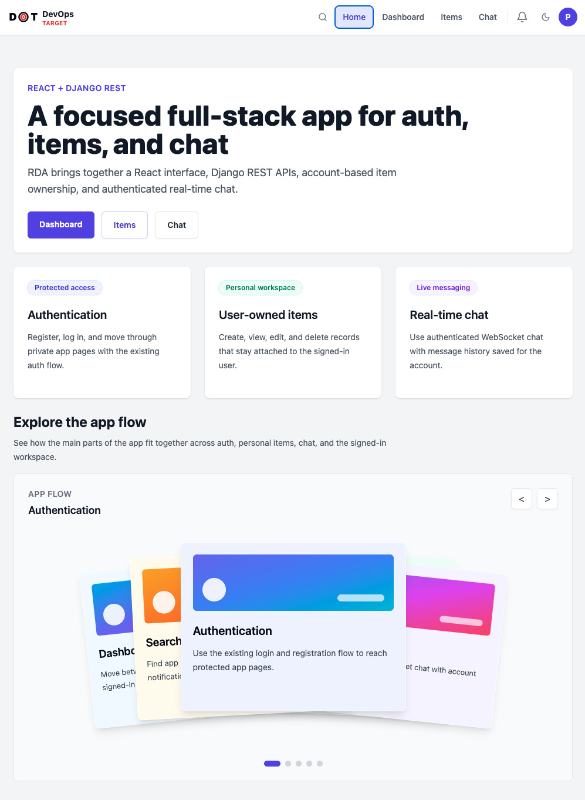
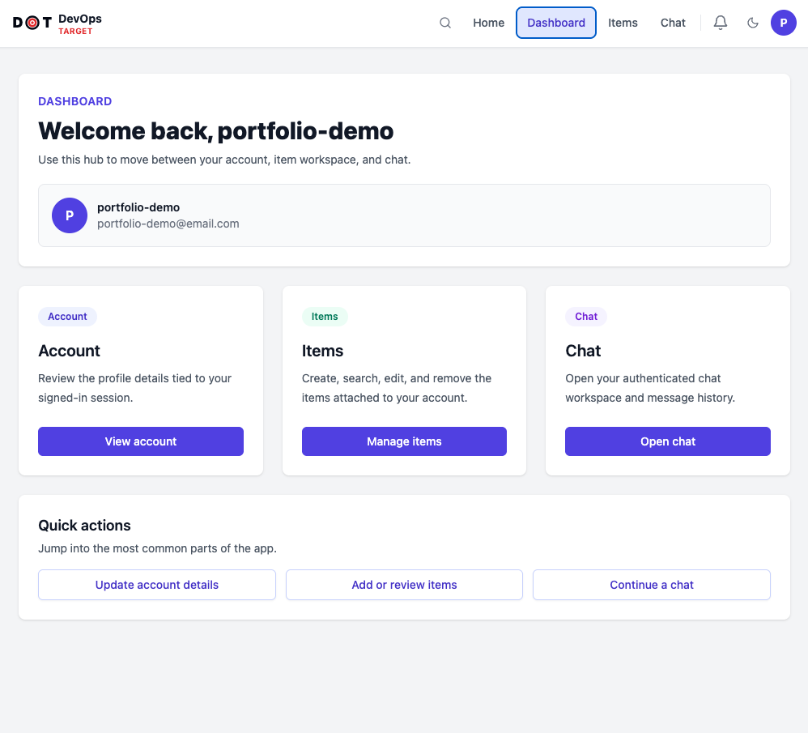
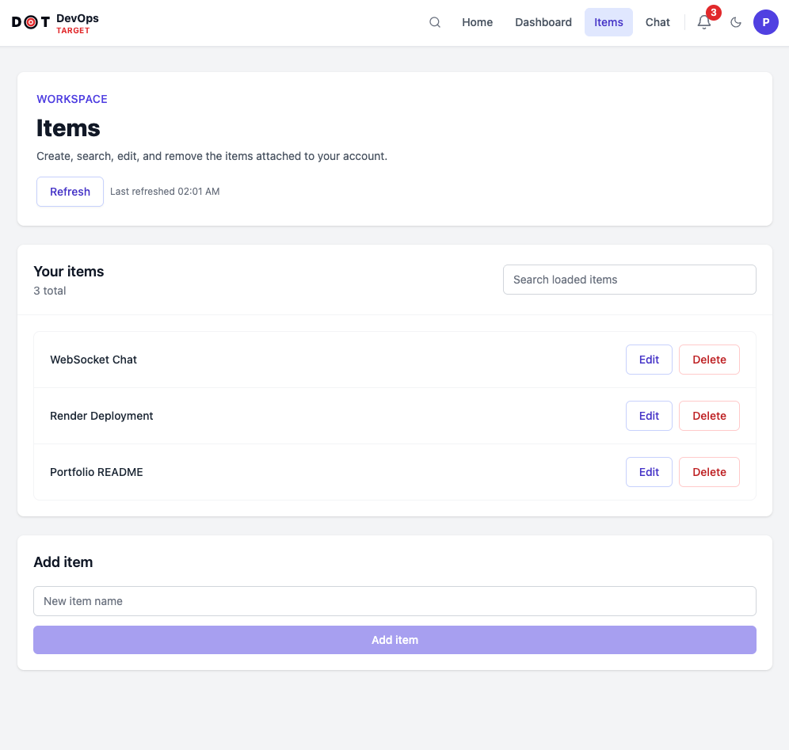
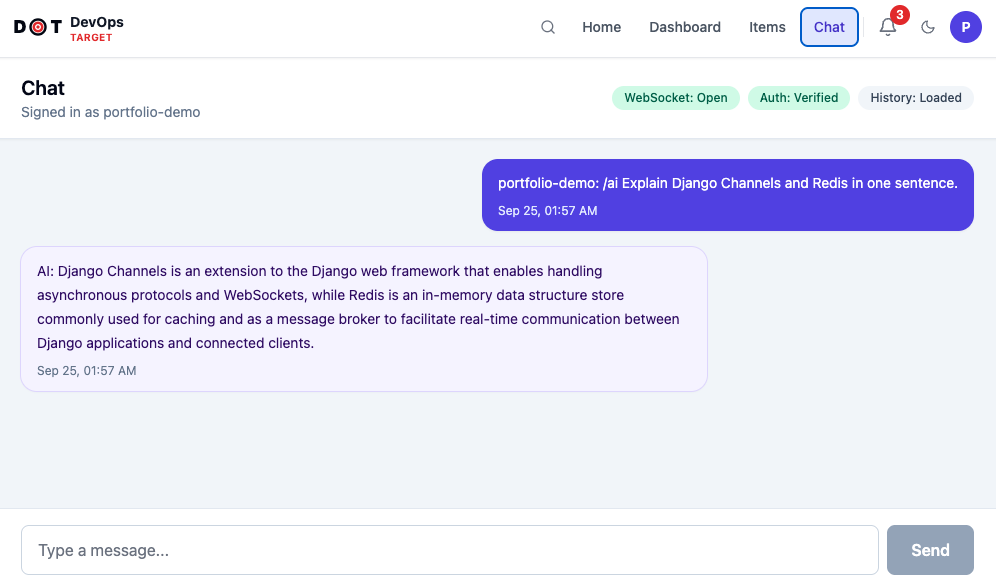
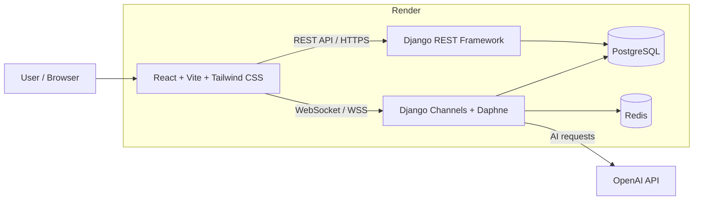

# Real-Time AI Chat Platform

Production-oriented full-stack application featuring authenticated user workflows,
real-time WebSocket messaging, persistent chat history, notifications, and
OpenAI-powered assistance.

## Live Demo

- **Application:** https://rda-frontend-zmln.onrender.com
- **API Health:** https://rda-backend-62d0.onrender.com/api/health/

> The application is hosted on Render. Free-tier services may take a short time to wake up after inactivity.

## Screenshots

### Application Overview



### Authenticated Dashboard



### User-Owned Items



### Real-Time AI Chat



## Highlights

- Secure user registration, login, and protected application routes
- Real-time authenticated messaging using WebSockets
- OpenAI-powered AI chat with validation and error handling
- Persistent chat history backed by PostgreSQL
- Redis-backed Django Channels for real-time communication
- User notifications and authenticated CRUD workflows
- Responsive, mobile-first React interface with dark/light mode
- Docker Compose production stack with PostgreSQL and Redis
- Automated backend tests and frontend production build checks
- GitHub Actions CI pipeline
- Production deployment on Render

## Tech Stack
**Frontend:**
*   React (Vite)
*   Tailwind CSS
*   Axios
*   React Router DOM
*   React Use WebSocket

**Backend:**
*   Python
*   Django
*   Django REST Framework
*   Django Channels
*   Channels Redis
*   Daphne
*   Djoser
*   OpenAI Python Library
*   python-dotenv

**Database:**
*   SQLite for local development
*   PostgreSQL for Docker and Render production deployments

## Architecture



### Request Flow

- **Frontend:** React/Vite application served as a Render Static Site.
- **REST API:** Django REST Framework handles authentication, user-owned items, notifications, and application data.
- **Real-time messaging:** Django Channels and Daphne handle authenticated WebSocket connections.
- **Redis:** Provides the Channels layer used for real-time communication.
- **PostgreSQL:** Stores users, authentication data, items, chat history, and application records.
- **OpenAI:** Processes `/ai` chat requests from authenticated WebSocket sessions.
- **Deployment:** Frontend, Django backend, PostgreSQL, and Redis are deployed through Render.

## Getting Started

Follow these instructions to set up and run the project locally.

### Prerequisites
*   Python 3.8+
*   Node.js (LTS version)
*   npm or Yarn
*   Redis Server (running on `localhost:6379`)

### 1. Clone the Repository
```bash
git clone https://github.com/developmentopstarget/devops-target-api.git
cd devops-target-api
```

### 2. Backend Setup (Django)

Navigate to the `backend` directory:
```bash
cd backend
```

**Create and Activate Virtual Environment:**
```bash
python3 -m venv .venv
source .venv/bin/activate
```

**Install Python Dependencies:**
```bash
pip install -r requirements.txt
```

**Configure Environment Variables:**
Create a `.env` file in the `backend/` directory and add your OpenAI API key:
```
OPENAI_API_KEY=your_openai_api_key_here
```
Replace `your_openai_api_key_here` with your actual OpenAI API key from [OpenAI Platform](https://platform.openai.com/api-keys).

**Run Database Migrations:**
```bash
python3 manage.py migrate
```

**Create a Superuser (for Admin Panel access):**
```bash
python3 manage.py createsuperuser
```
Follow the prompts to create your admin user.

**Start the Backend Server:**
For local development, run the backend on port `8000`:

~~~bash
python3 manage.py runserver 127.0.0.1:8000
~~~

Keep this terminal running. The local React frontend defaults to:

- API: `http://127.0.0.1:8000`
- WebSocket: `ws://127.0.0.1:8000`

### 3. Frontend Setup (React)

Open a **third terminal** and navigate to the `frontend` directory:
```bash
cd ../frontend
```

**Install Node.js Dependencies:**
~~~bash
npm install
~~~

**Optional local frontend environment:**
Create `frontend/.env` only if you need to override the local defaults:

~~~env
VITE_API_BASE_URL=http://127.0.0.1:8000
VITE_WS_BASE_URL=ws://127.0.0.1:8000
~~~

Do not commit local `.env` files.

**Start the React Development Server:**
~~~bash
npm run dev
~~~
Keep this terminal running.

### 4. Running Tests

**Backend:**
```bash
cd backend
python manage.py test
```

**Frontend (production build check):**
```bash
cd frontend
npm run build
```

## Docker Compose

The Docker Compose stack runs Postgres, Redis, Django (Daphne), and a React build
served by Nginx — all with a single command.

Nginx is the public entrypoint in the Docker stack. It serves the React SPA and
proxies API and WebSocket traffic to the internal backend service:

- `/api/` → `backend:8000`
- `/ws/` → `backend:8000`

`db`, `migrate`, and `backend` read environment variables from `backend/.env`.
The `frontend` service contains the React app compiled into its Nginx image at build
time; it does not use `backend/.env`.

In local Vite development, the frontend defaults to `http://127.0.0.1:8000` and
`ws://127.0.0.1:8000`. In a production build, if `VITE_API_BASE_URL` and
`VITE_WS_BASE_URL` are not provided, the frontend uses the current browser origin
so Docker/Nginx can proxy `/api/` and `/ws/` correctly.

**Prerequisites:** copy `backend/.env.example` to `backend/.env` and fill in at minimum
`DB_NAME`, `DB_USER`, `DB_PASSWORD`, and `SECRET_KEY`.

For production-style environments, also set:

- `DJANGO_ENV=production`
- `DEBUG=False`
- `ALLOWED_HOSTS`
- `CORS_ALLOWED_ORIGINS`
- `DATABASE_URL` or `DB_HOST` with DB settings
- `REDIS_URL`

**Start the stack:**
```bash
docker compose --env-file backend/.env up
```

**Stop the stack (preserves Postgres data):**
```bash
docker compose --env-file backend/.env down
```

> **Warning:** Do **not** add `-v` to the down command unless you intend to permanently
> delete all Postgres data. The `-v` flag removes the `postgres_data` named volume.

**Verify the stack is up** (Compose maps host port 80 → container port 80 on `frontend`):
```bash
curl -I http://localhost           # Nginx returns 200
curl http://localhost/api/items/   # returns 401 unless authenticated
```

## Deployment

The production application is deployed on Render:

- **Frontend:** React/Vite Static Site
- **Backend:** Django + Daphne Docker Web Service
- **Database:** PostgreSQL
- **Real-time layer:** Redis
- **CI/CD:** GitHub Actions

See [Deployment Guide](docs/DEPLOYMENT.md) for environment configuration, deployment settings, and post-deploy verification.

## CI / GitHub Actions

The `.github/workflows/ci.yml` workflow runs on every push and pull request to `main`
with three parallel jobs:

| Job | What it does |
|---|---|
| `backend-tests` | Installs Python 3.13 deps and runs `python manage.py test` |
| `frontend-build` | Installs Node 22 deps (`npm ci`) and runs `npm run build` |
| `docker-build` | Builds the `backend` and `frontend` Docker images |

## Accessing the Application

*   **Frontend — Vite local dev:** [http://localhost:5173](http://localhost:5173)
*   **Frontend — Docker/Nginx:** [http://localhost](http://localhost)
*   **Admin Panel:** [http://localhost:8000/admin/](http://localhost:8000/admin/)

Log in to the admin panel with your superuser credentials to view and manage chat messages.

## Usage

1.  Open your web browser and navigate to the frontend URL.
2.  **Register** a new user or **Log in** with your superuser credentials.
3.  Navigate to the `/chat` page.
4.  **Send a message to the AI:** In the chat input, type a message starting with `/ai ` (e.g., `/ai What is the capital of France?`). The AI will respond.
5.  **Real-time Chat:** Open another browser window (or incognito tab), log in with a different user, and navigate to the `/chat` page. Messages sent from either user will appear in both windows.

## Contributing
Feel free to fork the repository, open issues, or submit pull requests.

## License

This project is licensed under the MIT License. See [LICENSE](LICENSE) for details.

## Acknowledgements
*   React, Vite, Tailwind CSS
*   Django, Django REST Framework, Django Channels
*   OpenAI
